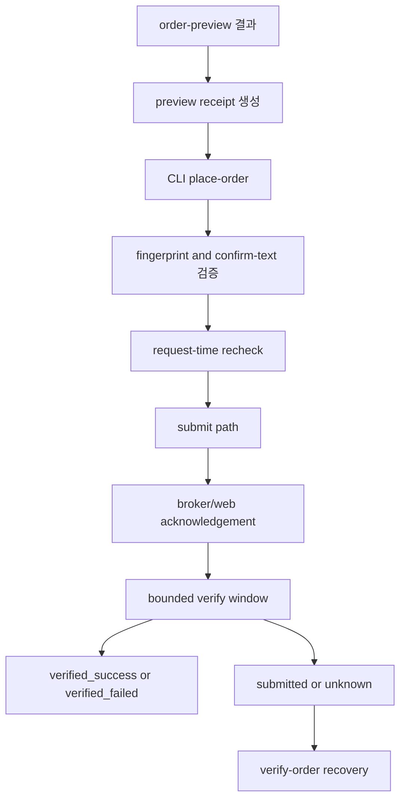

# Guarded Order Submit 스펙

## 개요

`toss-browser-bridge`의 다음 단계로 실제 주식 매수/매도 submit을 열되, `preview → explicit confirm → submit → post-submit verify`를 강제하는 guarded write path를 설계한다.

## 목적

현재 bridge는 read surface와 preview layer까지만 제공한다. 실제 돈이 움직이는 주문 submit은 다음 조건을 만족할 때만 열어야 한다.

- preview 없이 submit할 수 없어야 한다.
- 사용자가 의도를 다시 명시적으로 확인해야 한다.
- daemon은 submit 응답만으로 성공 처리하면 안 되고, post-submit requery까지 끝나야 최종 상태를 결정해야 한다.
- 네트워크 타임아웃, 중복 실행, partial success를 별도 상태로 다뤄야 한다.

성공 기준은 다음과 같다.

- `place-order`가 preview receipt와 preview fingerprint 일치 검사를 통과한 요청만 받는다.
- `--confirm`만으로는 부족하고, daemon이 생성한 확인 문구를 사용자가 다시 입력해야 한다.
- submit 결과는 `submitted`, `unknown`, `verified_success`, `verified_failed` 등으로 분리된다.
- 재시도와 중복 제출을 기본적으로 금지하고, 후속 복구는 `verify-order` 같은 별도 verify 경로로 수행한다.
- health capability가 submit readiness와 preview readiness를 분리해 표현한다.

## 범위

### In Scope

- `place-order` command contract 정의
- [보완] `verify-order` recovery command contract 정의
- 국내/미국 주식 buy/sell submit 안전장치 설계
- [보완] 초기 실제 submit 범위를 explicit `limit order`로 제한
- preview receipt와 submit payload 동일성 검증 규칙 정의
- explicit confirm UX와 CLI/daemon 계약 정의
- submit 전 request-time 재확인 항목 정의
- submit 결과 상태 모델 정의
- post-submit verify flow 정의
- idempotency 및 duplicate-prevention 정책 정의
- [보완] sanitized append-only mutation journal 최소 설계
- submit readiness capability semantics 정의
- 테스트 및 수동 검증 계획 정의

### Out of Scope

- `fx-exchange` 실제 submit
- `cancel-order` / `replace-order`
- 자동 재시도
- all-in / max-order 단축 명령
- [보완] market order 실제 submit
- 모바일 앱 또는 다른 브라우저 컨텍스트 지원
- 장기 영속 이벤트 저장소 확정

## 사용자와 제약

### 대상 사용자

- 토스증권 웹에 로그인된 전용 Chrome 프로필을 사용하는 로컬 사용자
- submit 전에 preview를 먼저 확인하는 사용 습관을 받아들일 수 있는 사용자
- 실패 시 자동 복구 대신 verify 결과를 직접 읽고 판단할 수 있는 사용자

### 핵심 제약

- browser-attached 모델을 유지한다.
- submit은 브라우저 컨텍스트 안에서만 수행한다.
- daemon과 전용 Chrome 프로필은 세션 동안 한 번만 올려 두고 유지한다.
- discovery와 검증은 이미 붙어 있는 daemon/browser 컨텍스트를 기준으로 수행하고, stale daemon 정리 같은 명확한 사유가 없는 한 반복 재기동하지 않는다.
- 토스증권이 요구하는 마지막 확인 UI를 우회하지 않는 hybrid 모델을 우선 검토한다.
- submit phase에서도 raw token, XSRF, accountNo, browser 식별 헤더는 디스크에 저장하지 않는다.
- 같은 요청을 네트워크 오류 직후 자동 재시도하지 않는다.
- [보완] daemon당 동시에 하나의 in-flight mutation만 허용한다.

## 설계

### 안전 불변조건

- preview receipt가 없는 submit은 거부한다.
- submit 직전에 preview receipt와 핵심 필드가 일치하지 않으면 거부한다.
- `--confirm`이 없으면 절대 submit하지 않는다.
- `--confirm`이 있어도 daemon이 생성한 canonical confirm phrase를 사용자가 다시 입력해야 한다.
- submit 후 즉시 성공을 반환하지 않는다.
- broker acknowledgement를 받지 못했거나 verify가 끝나지 않았으면 `unknown` 또는 `submitted` 상태로 남긴다.
- 자동 retry는 금지한다.
- [보완] `order_submit_ready=true`는 verify와 recovery 경로까지 포함해 안전 불변조건을 만족할 때만 가능하다.

### 상태 모델

```text
draft_preview
→ preview_ready
→ submit_requested
→ submit_blocked
→ submitted
→ unknown
→ verified_success
→ verified_failed
→ submit_cancelled
→ broker_rejected
```

설명:

- `submit_blocked`: preview는 존재하지만 confirm mismatch, fingerprint mismatch, request-time 재검증 실패 등으로 submit 진입 전 차단된 상태
- `submitted`: broker/web acknowledgement는 받았지만 post-submit verify는 아직 안 끝난 상태
- `unknown`: timeout, navigation breakage, ambiguous response 등으로 실제 주문 접수 여부가 확정되지 않은 상태
- `verified_success`: verify 단계에서 주문 체결/접수 사실이 확인된 상태
- `verified_failed`: submit은 시도됐지만 verify 결과 기대와 불일치하거나 실패 사실이 확인된 상태
- [보완] `submit_cancelled`: 사용자가 확인 UI에서 취소했거나 submit 직전 최종 승인 단계를 닫은 상태
- [보완] `broker_rejected`: broker가 명시적으로 주문 거부를 반환한 상태

### Preview Receipt

[보완] `preview_fingerprint`는 해시일 뿐이라 submit 시점 검증의 단독 입력으로는 부족하다. 초기 submit phase는 아래 둘 중 하나를 요구한다.

- `preview_receipt`
  - preview 응답의 canonical subset
  - 필수 필드: `preview_fingerprint`, `inputs`, `submit_candidate`, 마스킹된 `account_id`, submit 안전성에 직접 영향을 주는 최소 `derived`
- 또는 동일 daemon 세션에서 확인 가능한 process-local preview registry reference

초기 구현에서는 더 안전한 쪽인 `preview_receipt` 파일/JSON 입력을 우선한다.

이유:

- preview phase는 디스크 영속 preview cache를 만들지 않았다.
- fingerprint만으로는 preview 내용을 복원할 수 없다.
- submit 시점에 exact-match 검증과 request-time 재검증을 분리하려면 self-describing receipt가 필요하다.

### 명령 계약

#### `place-order`

필수 입력 후보:

- `--preview-receipt-file`
- `--preview-fingerprint`
- `--confirm`
- `--confirm-text`

[보완] order field를 CLI에서 다시 모두 받더라도, source of truth는 preview receipt여야 한다. CLI 재입력 필드는 receipt와 mismatch 여부를 확인하는 보조 장치로만 사용한다.

추가 확인 규칙:

- daemon이 preview receipt의 canonical fields로 confirm phrase를 생성한다
- CLI는 그 문자열을 사용자에게 다시 보여주고, 동일 문자열을 `--confirm-text`로 받는다
- canonical phrase는 locale-independent ASCII 형식으로 유지한다

예시:

```text
BUY 3 AAPL LIMIT 201.50 US
SELL 5 A005930 LIMIT 71200 KR
```

#### `verify-order`

[보완] `verify-order --mutation-id ...`를 companion command로 둔다.

역할:

- `submitted` 또는 `unknown` 상태를 나중에 다시 검증
- daemon 재기동 뒤에도 mutation journal 기준으로 recovery 시도
- verify-only 재조회 결과를 일관된 상태 모델로 반환

#### Daemon Query Kind

- `place_order`
- [보완] `verify_order`

### 응답 shape

`place_order` 응답 초안:

```json
{
  "ok": true,
  "kind": "place_order",
  "source": "toss_browser_bridge",
  "checked_at": "2026-04-17T13:00:00+09:00",
  "capability": "order_submit_ready",
  "data": {
    "mutation_id": "mut_...",
    "preview_fingerprint": "sha256:...",
    "submit_state": "submitted",
    "broker_ack": {},
    "verification_state": "pending",
    "verification_plan": {},
    "warnings": []
  },
  "diagnostics": {
    "endpoint_matrix": [],
    "last_errors": []
  }
}
```

[보완] `broker_ack`는 sanitized summary만 허용한다. raw payload, raw headers, accountNo, token, browser identifiers는 포함하지 않는다.

### Mutation Journal

[보완] preview phase와 다르게 submit phase에서는 최소한의 sanitized append-only mutation journal이 필요하다.

목적:

- `unknown` 상태 recovery
- daemon restart 뒤 `verify-order` 재실행
- duplicate-prevention을 프로세스 생명주기 밖까지 일부 연장

허용 필드 예시:

- `mutation_id`
- `kind`
- `requested_at`
- `preview_fingerprint`
- `confirm_phrase_hash`
- `submit_state`
- `verification_state`
- sanitized `broker_ack` summary
- verify snapshot summary

금지 필드:

- raw bearer token
- XSRF token
- raw accountNo
- App-Version
- Browser-Tab-Id
- raw request body 전체
- raw response body 전체

초기 형태는 `TOSS_BRIDGE_HOME` 하위 append-only JSONL이면 충분하다. 장기 저장소 설계는 후속 범위다.

### Capability semantics

- `order_submit_ready`
  - 최소 기준: `order_preview_ready=true`
  - [보완] 추가 기준:
    - submit path discovery 완료
    - verify path discovery 완료
    - mutation journal writable
    - single in-flight mutation gate 정상
  - request-time으로는 다시 계좌/시세/보유수량을 재확인한다
- `post_submit_verify_ready`
  - `completed_orders`, `positions`, `account_summary` 재조회 조합이 동작할 때만 true

`order_submit_ready`는 `post_submit_verify_ready`가 false면 true가 될 수 없다.

`fx_submit_ready`와 `cancel_order_ready`는 이 task에서 다루지 않는다.

### 실행 모델



### submit 방식

첫 구현은 hybrid를 기본으로 둔다.

- preview: 기존 fetch 기반
- submit: 우선순위는 `in-page mutation fetch` 조사
- [보완] submit path가 마지막 확인 UI를 안정적으로 대체하지 못하면 UI confirm fallback으로 전환
- verify: fetch 기반 재조회

전환 기준:

- fetch path가 broker acknowledgement semantics를 명확히 주지 못하는 경우
- confirm UI를 우회하면 주문 의미가 달라질 수 있는 경우
- anti-duplicate 또는 anti-bot 문맥이 UI state에 묶여 있는 경우

### request-time 재검증

submit 직전 최소 재검증 항목:

- 로그인 상태
- preview receipt fingerprint와 입력 필드 일치 여부
- buy 시 orderable cash
- sell 시 positions quantity
- 종목 식별자와 시장 코드
- order type, quantity, limit price
- 시장 상태 또는 거래 가능 상태

[보완] hard-block 항목:

- product code mismatch
- market mismatch
- order type mismatch
- quantity mismatch
- limit price mismatch
- buying power 부족
- sell quantity 부족

보조 필드 변화는 warning 또는 verify 단계 참고 신호로 남길 수 있다.

재검증이 실패하면 `submit_blocked` 또는 domain error로 반환한다.

### Duplicate Prevention

초기 버전 정책:

- 같은 `preview_fingerprint`로 같은 프로세스에서 짧은 시간 안에 재제출 시도 시 차단
- mutation journal 상 동일 fingerprint + 동일 confirm phrase hash가 최근 남아 있으면 차단
- timeout 뒤 자동 재시도 금지
- `unknown` 상태는 사용자가 `verify-order` 또는 diagnostics를 보고 판단하도록 남김

후속 phase에서만 richer idempotency store를 검토한다.

### Verify 전략

buy/sell 공통:

- `completed_orders`
- `positions`
- `account_summary`

검증 규칙 예시:

- 최근 주문 내역에 동일 종목/수량/방향 주문이 생겼는지
- positions 수량 변화가 기대와 맞는지
- orderable cash 변화가 방향과 일치하는지

verify는 단일 신호로 결정하지 않고 다중 신호를 조합해야 한다.

[보완] `place-order`는 bounded verify window만 수행한다. 이 창 안에 결론이 안 나면 무한 대기하지 않고 `submitted` 또는 `unknown`으로 반환한다. 이후 `verify-order`가 recovery를 맡는다.

### 오류 분류

- `invalid_request`
  - confirm-text 누락, preview receipt 누락, fingerprint 누락
- `logged_out`
  - 세션 종료
- `capability_not_ready`
  - submit path 또는 verify path 미준비
- `submit_blocked`
  - request-time 재검증 실패
- [보완] `submit_cancelled`
  - 사용자가 최종 confirm UI 또는 explicit approval 단계에서 취소
- [보완] `broker_rejected`
  - broker가 주문 거부를 명시
- `submit_failed`
  - submit 시도는 했지만 실패가 명시적으로 확인됨
- `submit_unknown`
  - timeout, ambiguous response
- `verification_failed`
  - verify 결과가 기대와 불일치
- `runtime_error`
  - 예기치 않은 예외만 사용

## 구현 계획

### Phase 0: Safety Contract

- [ ] `place-order` command contract와 canonical confirm phrase 규칙 고정
- [ ] preview receipt schema 고정
- [ ] submit state/error taxonomy 고정
- [ ] `order_submit_ready`, `post_submit_verify_ready` semantics 고정
- [ ] mutation journal 최소 schema 고정
- [ ] duplicate-prevention 정책 고정

### Phase 1: Submit Path Discovery

- [ ] order submit endpoint family 또는 UI confirm path 실측
- [ ] submit에 필요한 request payload와 필수 헤더 조건 파악
- [ ] ambiguous response 케이스 수집
- [ ] market/limit, buy/sell 조합 차이 확인
- [ ] [보완] 실제 execution rollout은 `limit order`만 대상으로 시작

### Phase 2: Guarded Submit Implementation

- [ ] CLI `place-order` 추가
- [ ] daemon `place_order` wiring 추가
- [ ] confirm-text, preview receipt, request-time 재검증 구현
- [ ] submit path 구현
- [ ] mutation journal append 구현
- [ ] mutation state payload 구현

### Phase 3: Verify and Recovery

- [ ] CLI `verify-order` 추가
- [ ] post-submit verify 조합 구현
- [ ] `unknown` 상태 처리 경로 구현
- [ ] daemon restart 후 recovery 경로 구현
- [ ] 로컬 수동 검증 시나리오 고정

## 영향 분석

| 영역 | 변경 내용 | 위험도 | 완화 방안 |
|------|----------|--------|----------|
| CLI | 실제 주문 명령 추가 | 매우 높음 | confirm phrase 재입력과 preview receipt 일치 검사를 강제 |
| daemon | submit/verify 상태 모델 추가 | 매우 높음 | preview domain error와 분리된 submit taxonomy 사용 |
| capability matrix | submit readiness 노출 | 매우 높음 | verify readiness와 journal readiness까지 포함한 보수적 계산 |
| runtime storage | mutation journal 추가 | 높음 | append-only, sanitized JSONL, 민감필드 금지 |
| 테스트 | 실제 계좌 기반 검증 필요 | 매우 높음 | 자동 submit 금지, 실제 submit은 수동 supervised checklist로만 수행 |
| 운영 | 중복 제출/unknown 상태 | 매우 높음 | auto retry 금지, duplicate-prevention, `verify-order` recovery |

## 테스트 계획

### 단위 테스트

- confirm phrase canonicalization
- preview receipt schema validation
- preview fingerprint mismatch detection
- submit state transition helper
- duplicate-prevention window
- mutation journal sanitization

### 통합 테스트

- daemon `place_order` domain error contract
- request-time recheck failure
- verify aggregator
- `unknown` 상태 분기
- `verify-order` recovery contract

### 라이브 테스트

- 로그인된 실제 세션에서 submit discovery smoke test
- [보완] automated pytest에서는 실제 주문 submit 금지
- 실제 submit 검증은 가장 마지막 Phase에서만, 소액 limit order 기준 수동 supervised checklist로 수행
- live submit 전에는 preview receipt 출력, confirm phrase 확인, 완료 판정 기준을 문서화한다

### 엣지 케이스

- preview 후 시세/잔액이 바뀐 경우
- sell preview 이후 보유수량이 줄어든 경우
- limit order price mismatch
- submit ack 성공 후 verify 미일치
- 네트워크 timeout 직후 실제 주문이 들어간 경우
- user cancel 후 ambiguous UI state
- daemon restart 뒤 `unknown` mutation recovery

## 결정 사항

- 첫 실제 write scope는 `place-order`만 다룬다: 범위를 좁혀야 안전장치의 밀도를 유지할 수 있다.
- [보완] 초기 실제 submit은 limit order만 연다: market order는 가격 슬리피지와 의미 해석 리스크가 더 크다.
- 초기 확인 장치는 `--confirm` 단독이 아니라 daemon-generated confirm phrase 재입력을 포함한다: 실제 돈이 움직이는 작업에서 단순 flag는 약하다.
- auto retry는 금지한다: duplicate order 리스크가 너무 크다.
- 성공 기준은 submit response가 아니라 verify 완료다: broker/web acknowledgement만으로는 충분하지 않다.
- [보완] preview fingerprint 단독 입력은 허용하지 않는다: self-describing preview receipt 또는 안전한 registry reference가 필요하다.
- [보완] `unknown` 복구를 위해 minimal mutation journal을 도입한다: 실제 write에서는 preview phase의 무상태 모델이 부족하다.

## 열린 질문

- 실제 주문 submit이 최종적으로 fetch 기반으로 가능한지, 아니면 마지막 단계에서 UI confirm이 강제되는지
- 국내/미국 주문 submit endpoint family가 동일한지, 시장별 분기가 필요한지
- bounded verify window의 기본 시간값을 얼마로 둘지
