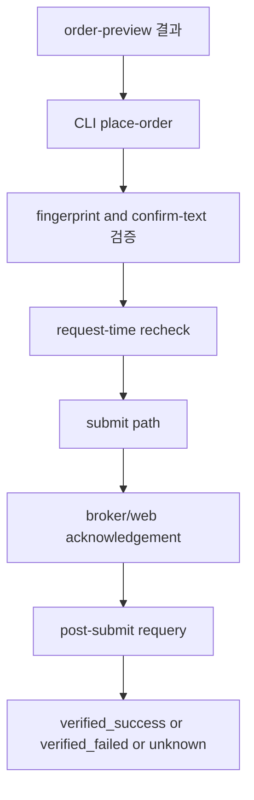

# Guarded Order Submit 스펙

## 개요

`toss-browser-bridge`의 다음 단계로 실제 주식 매수/매도 submit을 열되, `preview → explicit confirm → submit → post-submit verify`를 강제하는 guarded write path를 설계한다.

## 목적

현재 bridge는 read surface와 preview layer까지만 제공한다. 실제 돈이 움직이는 주문 submit은 다음 조건을 만족할 때만 열어야 한다.

- preview 없이 submit할 수 없어야 한다.
- 사용자가 의도를 다시 명시적으로 확인해야 한다.
- daemon은 submit 응답만으로 성공 처리하면 안 되고, post-submit requery까지 끝나야 최종 상태를 결정해야 한다.
- 네트워크 타임아웃, 중복 실행, partial success를 별도 상태로 다뤄야 한다.

성공 기준은 다음과 같다.

- `place-order`가 buy/sell 모두에서 preview fingerprint 일치 검사를 통과한 요청만 받는다.
- `--confirm`만으로는 부족하고, 사람이 주문 핵심 필드를 다시 검토할 수 있는 명시적 확인 단계가 있다.
- submit 결과는 `submitted`, `unknown`, `verified_success`, `verified_failed` 등으로 분리된다.
- 재시도와 중복 제출을 기본적으로 금지하고, 후속 복구는 별도 verify 경로로 수행한다.
- health capability가 submit readiness와 preview readiness를 분리해 표현한다.

## 범위

### In Scope

- `place-order` command contract 정의
- 국내/미국 주식 buy/sell submit만 첫 write scope로 설계
- preview fingerprint와 submit payload 동일성 검증 규칙 정의
- explicit confirm UX와 CLI/daemon 계약 정의
- submit 전 request-time 재확인 항목 정의
- submit 결과 상태 모델 정의
- post-submit verify flow 정의
- idempotency 및 duplicate-prevention 정책 정의
- submit readiness capability semantics 정의
- 테스트 및 로컬 E2E 계획 정의

### Out of Scope

- `fx-exchange` 실제 submit
- `cancel-order` / `replace-order`
- 자동 재시도
- all-in / max-order 단축 명령
- market order 기본값
- 모바일 앱 또는 다른 브라우저 컨텍스트 지원
- 장기 영속 이벤트 저장소 확정

## 사용자와 제약

### 대상 사용자

- 토스증권 웹에 로그인된 전용 Chrome 프로필을 사용하는 로컬 사용자
- submit 전에 preview를 먼저 확인하는 사용 습관을 받아들일 수 있는 사용자
- 실패 시 자동 복구 대신 verify 결과를 직접 읽고 판단할 수 있는 사용자

### 핵심 제약

- browser-attached 모델을 유지한다.
- submit은 브라우저 컨텍스트 안에서만 수행한다.
- 토스증권이 요구하는 마지막 확인 UI를 우회하지 않는 hybrid 모델을 우선 검토한다.
- submit phase에서도 민감정보는 디스크에 저장하지 않는다.
- 같은 요청을 네트워크 오류 직후 자동 재시도하지 않는다.

## 설계

### 안전 불변조건

- preview fingerprint가 없는 submit은 거부한다.
- submit 직전에 preview와 핵심 필드가 일치하지 않으면 거부한다.
- `--confirm`이 없으면 절대 submit하지 않는다.
- `--confirm`이 있어도 사용자가 확인 문구를 다시 입력하거나, 최소한 핵심 필드 요약을 다시 승인해야 한다.
- submit 후 즉시 성공을 반환하지 않는다.
- broker acknowledgement를 받지 못했거나 verify가 끝나지 않았으면 `unknown` 또는 `submitted` 상태로 남긴다.
- 자동 retry는 금지한다.

### 상태 모델

```text
draft_preview
→ preview_ready
→ submit_requested
→ submit_blocked
→ submitted
→ unknown
→ verified_success
→ verified_failed
```

설명:

- `submit_blocked`: preview는 존재하지만 confirm mismatch, fingerprint mismatch, request-time 재검증 실패 등으로 submit 진입 전 차단된 상태
- `submitted`: broker/web acknowledgement는 받았지만 post-submit verify는 아직 안 끝난 상태
- `unknown`: timeout, navigation breakage, ambiguous response 등으로 실제 주문 접수 여부가 확정되지 않은 상태
- `verified_success`: verify 단계에서 주문 체결/접수 사실이 확인된 상태
- `verified_failed`: submit은 시도됐지만 verify 결과 기대와 불일치하거나, 실패 사실이 확인된 상태

### 명령 계약

#### Preview 선행

`place-order`는 새 계산을 하지 않는다. 직전 `order-preview` 결과의 핵심 필드를 그대로 받아서 일치 여부만 검증한다.

필수 입력 후보:

- `--preview-fingerprint`
- `--market`
- `--side`
- `--symbol`
- `--order-type`
- `--quantity`
- `--limit-price` (limit only)
- `--confirm`

추가 확인 장치 후보:

- `--confirm-text 'BUY 3 AAPL LIMIT 201.5'`
- 또는 daemon이 요약 문자열을 만들어 CLI가 다시 출력하고, 사용자가 동일 문자열을 재입력

초기 버전에서는 단순 boolean confirm보다 `confirm-text` 재입력이 안전하다.

#### Daemon Query Kind

- `place_order`

응답 shape 초안:

```json
{
  "ok": true,
  "kind": "place_order",
  "source": "toss_browser_bridge",
  "checked_at": "2026-04-17T13:00:00+09:00",
  "capability": "order_submit_ready",
  "data": {
    "mutation_id": "mut_...",
    "preview_fingerprint": "sha256:...",
    "submit_state": "submitted",
    "broker_ack": {},
    "verification_state": "pending",
    "verification_plan": {},
    "warnings": []
  },
  "diagnostics": {
    "endpoint_matrix": [],
    "last_errors": []
  }
}
```

### Capability semantics

- `order_submit_ready`
  - 최소 기준: `order_preview_ready=true`
  - 추가 기준: submit endpoint family 또는 UI confirm path가 실측으로 확인됨
  - request-time으로는 다시 계좌/시세/보유수량을 재확인한다
- `post_submit_verify_ready`
  - `completed_orders`, `positions`, `account_summary` 재조회 조합이 동작할 때만 true

`fx_submit_ready`와 `cancel_order_ready`는 이 task에서 다루지 않는다.

### 실행 모델



### submit 방식

첫 구현은 hybrid를 기본으로 둔다.

- preview: 기존 fetch 기반
- submit: 우선순위는 `in-page mutation fetch` 조사, 실패 시 UI confirm fallback
- verify: fetch 기반 재조회

이유:

- submit을 전부 UI automation으로 가면 유지보수성이 급격히 나빠진다.
- 반대로 submit을 전부 fetch로 단정하면 실제 확인 단계와 anti-bot/anti-duplicate 조건을 놓칠 수 있다.

### request-time 재검증

submit 직전 최소 재검증 항목:

- 로그인 상태
- preview fingerprint와 입력 필드 일치 여부
- buy 시 orderable cash
- sell 시 positions quantity
- 종목 식별자와 시장 코드
- 시장 상태 또는 거래 가능 상태

재검증이 실패하면 `submit_blocked` 또는 domain error로 반환한다.

### duplicate prevention

초기 버전 정책:

- 같은 `preview_fingerprint`로 같은 프로세스에서 짧은 시간 안에 재제출 시도 시 차단
- timeout 뒤 자동 재시도 금지
- `unknown` 상태는 사용자가 verify 전용 명령 또는 diagnostics를 보고 판단하도록 남김

후속 phase에서만 mutation journal 영속화를 검토한다.

### verify 전략

buy/sell 공통:

- `completed_orders`
- `positions`
- `account_summary`

검증 규칙 예시:

- 최근 주문 내역에 동일 종목/수량/방향 주문이 생겼는지
- positions 수량 변화가 기대와 맞는지
- orderable cash 변화가 방향과 일치하는지

verify는 단일 신호로 결정하지 않고 다중 신호를 조합해야 한다.

### 오류 분류

- `invalid_request`
  - confirm-text 누락, preview fingerprint 누락, limit price mismatch
- `logged_out`
  - 세션 종료
- `capability_not_ready`
  - submit path 또는 verify path 미준비
- `submit_blocked`
  - request-time 재검증 실패
- `submit_failed`
  - submit 시도는 했지만 실패가 명시적으로 확인됨
- `submit_unknown`
  - timeout, ambiguous response
- `verification_failed`
  - verify 결과가 기대와 불일치
- `runtime_error`
  - 예기치 않은 예외만 사용

## 구현 계획

### Phase 0: Safety Contract

- [ ] `place-order` command contract와 confirm-text 규칙 고정
- [ ] submit state/error taxonomy 고정
- [ ] `order_submit_ready`, `post_submit_verify_ready` semantics 고정
- [ ] duplicate-prevention 정책 고정

### Phase 1: Submit Path Discovery

- [ ] order submit endpoint family 또는 UI confirm path 실측
- [ ] submit에 필요한 request payload와 필수 헤더 조건 파악
- [ ] ambiguous response 케이스 수집
- [ ] market/limit, buy/sell 각 4조합의 차이 확인

### Phase 2: Guarded Submit Implementation

- [ ] CLI `place-order` 추가
- [ ] daemon `place_order` wiring 추가
- [ ] confirm-text, fingerprint, request-time 재검증 구현
- [ ] submit path 구현
- [ ] mutation state payload 구현

### Phase 3: Verify and Recovery

- [ ] post-submit verify 조합 구현
- [ ] `unknown` 상태 처리 경로 구현
- [ ] verify 전용 재실행 또는 diagnostics 경로 설계
- [ ] 로컬 live E2E 검증 시나리오 고정

## 영향 분석

| 영역 | 변경 내용 | 위험도 | 완화 방안 |
|------|----------|--------|----------|
| CLI | 실제 주문 명령 추가 | 매우 높음 | confirm-text와 fingerprint 일치 검사를 강제 |
| daemon | submit/verify 상태 모델 추가 | 매우 높음 | preview domain error와 분리된 submit taxonomy 사용 |
| capability matrix | submit readiness 노출 | 높음 | health와 request-time check를 분리하고 보수적으로 계산 |
| 테스트 | 실제 계좌 기반 E2E 필요 | 매우 높음 | live test를 opt-in으로 유지하고 소액/모의 시나리오부터 시작 |
| 운영 | 중복 제출/unknown 상태 | 매우 높음 | auto retry 금지, duplicate-prevention, verify 우선 정책 |

## 테스트 계획

### 단위 테스트

- confirm-text canonicalization
- preview fingerprint mismatch detection
- submit state transition helper
- duplicate-prevention window

### 통합 테스트

- daemon `place_order` domain error contract
- request-time recheck failure
- verify aggregator
- `unknown` 상태 분기

### 라이브 테스트

- 로그인된 실제 세션에서 submit discovery smoke test
- 실제 submit은 가장 마지막 Phase에서만, 소액 limit order 기준으로 opt-in 실행
- live submit 전에는 dry-run style precheck와 explicit user action 기록 필요

### 엣지 케이스

- preview 후 시세/잔액이 바뀐 경우
- sell preview 이후 보유수량이 줄어든 경우
- limit order price mismatch
- submit ack 성공 후 verify 미일치
- 네트워크 timeout 직후 실제 주문이 들어간 경우

## 결정 사항

- 첫 실제 write scope는 `place-order`만 다룬다: 범위를 좁혀야 안전장치의 밀도를 유지할 수 있다.
- 초기 확인 장치는 `--confirm` 단독이 아니라 `confirm-text` 재입력을 포함한다: 실제 돈이 움직이는 작업에서 단순 flag는 약하다.
- auto retry는 금지한다: duplicate order 리스크가 너무 크다.
- 성공 기준은 submit response가 아니라 verify 완료다: broker/web acknowledgement만으로는 충분하지 않다.

## 열린 질문

- 실제 주문 submit이 fetch 기반으로 가능한지, 아니면 마지막 단계는 UI confirm이 필요한지
- `unknown` 상태를 복구하는 verify 전용 command를 별도로 둘지
- preview fingerprint 외에 submit 전용 nonce나 mutation_id를 메모리에 추가로 둘지
- 국내/미국 주문 submit endpoint family가 같은 패턴인지, 시장별 분기가 필요한지
